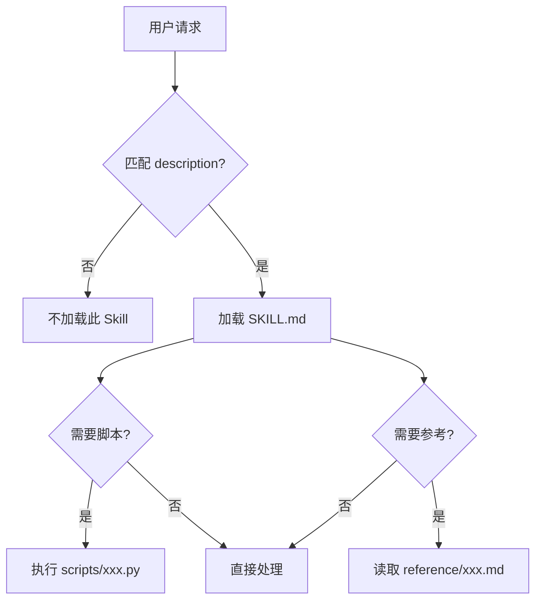
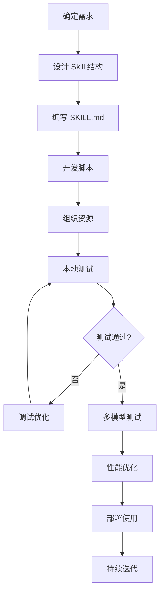

# Claude Skills 开发完全指南

> **📖 一份详尽的 Claude Skills 开发教程**  
> 从零开始，手把手教你创建专业的 Claude Skills

---

## 📑 目录

1. [什么是 Claude Skills](#1-什么是-claude-skills)
2. [核心概念与架构](#2-核心概念与架构)
3. [开发环境准备](#3-开发环境准备)
4. [Skill 文件结构详解](#4-skill-文件结构详解)
5. [SKILL.md 编写指南](#5-skillmd-编写指南)
6. [Scripts 脚本开发](#6-scripts-脚本开发)
7. [Reference 资源组织](#7-reference-资源组织)
8. [最佳实践与设计模式](#8-最佳实践与设计模式)
9. [测试与调试](#9-测试与调试)
10. [部署与使用](#10-部署与使用)
11. [完整示例](#11-完整示例)
12. [常见问题与解决方案](#12-常见问题与解决方案)

---

## 1. 什么是 Claude Skills

### 1.1 定义

**Claude Skills** 是一种标准化的能力包（Capability Package），它将专家的隐性知识系统化封装，使 AI Agent 能够成为真正的领域专家。

### 1.2 核心价值

- ✅ **知识封装**：将领域专家的经验打包成可复用的模块
- ✅ **自动发现**：Claude 根据任务需求自动加载相关 Skill
- ✅ **上下文优化**：渐进式加载，只在需要时占用 token
- ✅ **跨平台通用**：一次创建，可在 API、Claude Code、claude.ai 中使用

### 1.3 适用场景

| 场景类型 | 示例 |
|---------|------|
| **文档生成** | 财务报告、PPT 演示、合同模板 |
| **数据分析** | 财务比率计算、数据可视化、统计分析 |
| **业务流程** | 品牌规范应用、审批流程、质量检查 |
| **领域专业** | 法律文书、医疗诊断辅助、工程计算 |

---

## 2. 核心概念与架构

### 2.1 三层结构

每个 Skill 由三个核心部分构成：

```
my-skill/
├── SKILL.md          # 📋 SOP（标准作业程序）- 专家的行动剧本
├── scripts/          # 🔧 工具（Tools）- 确定性的可靠函数
│   └── processor.py
└── reference/        # 📚 资源（Resources）- API 文档、配置文件
    └── guide.md
```

#### **SOP (SKILL.md)**
- 固化程序性知识
- 提供工作流程和最佳实践
- 告诉 Claude "如何做"

#### **工具 (scripts/)**
- 封装操作性知识
- 提供确定性的计算和处理
- 避免 Claude 重复生成代码

#### **资源 (reference/)**
- 精选知识库
- API 文档、配置文件、示例数据
- 提供参考信息

### 2.2 渐进式披露（Progressive Disclosure）

这是 Skills 最重要的设计理念，确保只有相关内容才会占用上下文窗口。

#### **三个加载层级**

| 层级 | 内容 | 加载时机 | Token 消耗 |
|------|------|----------|-----------|
| **Level 1** | `name` + `description` | 启动时始终加载 | ~100 tokens/skill |
| **Level 2** | SKILL.md 主体内容 | Skill 被触发时 | ~5k tokens |
| **Level 3** | scripts + reference 文件 | 按需引用时 | 几乎无限制 |

#### **工作原理**



### 2.3 运行时环境

Skills 运行在具有以下能力的代码执行环境中：

- ✅ **文件系统访问**：可以读写文件
- ✅ **Bash 命令**：可以执行 shell 命令
- ✅ **代码执行**：可以运行 Python、JavaScript 等
- ✅ **包管理**：可以安装 npm 和 PyPI 包（claude.ai）
- ⚠️ **无网络访问**（API 环境）：无法在运行时安装包

---

## 3. 开发环境准备

### 3.1 必需工具

```bash
# 1. Python 3.8+
python --version

# 2. 文本编辑器（推荐 VS Code）
code --version

# 3. Git（用于版本控制）
git --version

# 4. Anthropic SDK（用于测试）
pip install anthropic
```

### 3.2 项目结构模板

创建标准的开发目录：

```bash
mkdir my-skills-project
cd my-skills-project

# 创建标准结构
mkdir -p skills/{skill-name}/{scripts,reference}
touch skills/skill-name/SKILL.md
touch .env
touch test_skill.py
```

### 3.3 环境配置

创建 `.env` 文件：

```bash
# .env
ANTHROPIC_API_KEY=your_api_key_here
```

创建 `test_skill.py` 测试脚本：

```python
import os
from anthropic import Anthropic
from dotenv import load_dotenv

load_dotenv()

client = Anthropic(api_key=os.getenv("ANTHROPIC_API_KEY"))

# 测试代码将在后面添加
```

---

## 4. Skill 文件结构详解

### 4.1 完整目录结构

```
my-skill/
├── SKILL.md                    # 必需：主指令文件
├── scripts/                    # 可选：可执行脚本
│   ├── __init__.py            # Python 包初始化
│   ├── main_processor.py      # 主处理脚本
│   ├── validator.py           # 验证脚本
│   └── utils.py               # 工具函数
├── reference/                  # 可选：参考资料
│   ├── api_docs.md            # API 文档
│   ├── examples.md            # 使用示例
│   ├── templates/             # 模板文件
│   │   └── report_template.xlsx
│   └── data/                  # 示例数据
│       └── sample.json
└── tests/                      # 可选：测试文件
    └── test_processor.py
```

### 4.2 文件命名规范

#### **Skill 目录名**
- ✅ 使用小写字母
- ✅ 使用连字符分隔单词
- ✅ 使用动名词形式（verb + -ing）
- ✅ 最大 64 字符
- ❌ 不使用下划线、空格、大写字母

```bash
# 好的命名
analyzing-financial-data
processing-legal-documents
generating-marketing-reports

# 不好的命名
Financial_Analysis
process documents
LEGAL-DOCS
```

#### **脚本文件名**
- 使用小写字母和下划线
- 描述性命名，表明功能
- Python 文件使用 `.py` 扩展名

```bash
# 好的命名
calculate_ratios.py
validate_input.py
generate_report.py

# 不好的命名
script1.py
temp.py
utils.py  # 太泛化
```

#### **参考文件名**
- 使用小写字母和下划线
- Markdown 文件使用 `.md` 扩展名
- 按主题组织

```bash
# 好的命名
api_reference.md
usage_examples.md
troubleshooting_guide.md
```

---

## 5. SKILL.md 编写指南

### 5.1 YAML Frontmatter（必需）

SKILL.md 文件**必须**以 YAML frontmatter 开头：

```yaml
---
name: skill-name
description: 简洁描述这个 Skill 做什么以及何时使用它
---
```

#### **name 字段规范**

| 规则 | 说明 | 示例 |
|------|------|------|
| 长度 | 最大 64 字符 | ✅ `analyzing-financial-statements` |
| 字符 | 小写字母、数字、连字符 | ❌ `Financial_Analysis` |
| 格式 | 动名词形式 | ✅ `processing-invoices` |
| 禁止 | XML 标签、保留字 | ❌ `<skill>name</skill>` |

#### **description 字段规范**

| 规则 | 说明 |
|------|------|
| 长度 | 最大 1024 字符 |
| 内容 | 必须包含"做什么"和"何时用" |
| 语气 | 使用第三人称 |
| 关键词 | 包含触发词，便于 Claude 匹配 |

**好的 description 示例**：

```yaml
description: Calculates financial ratios (ROE, ROA, P/E, etc.) from financial statements and provides industry benchmark comparisons. Use when analyzing company performance, evaluating investments, or comparing financial metrics.
```

**不好的 description 示例**：

```yaml
# ❌ 太简短，缺少触发场景
description: Financial analysis tool

# ❌ 太泛化，没有具体功能
description: Helps with finance stuff

# ❌ 使用第一人称
description: I can help you analyze financial data
```

### 5.2 主体内容结构

SKILL.md 主体应该遵循清晰的结构：

```markdown
---
name: your-skill-name
description: Your skill description
---

# Skill Title

Brief overview of what this skill does (1-2 sentences).

## Capabilities

List what this skill can do:
- Capability 1
- Capability 2
- Capability 3

## How to Use

Step-by-step instructions:
1. Step 1
2. Step 2
3. Step 3

## Input Format

Describe expected input:
- Format 1: Description
- Format 2: Description

## Output Format

Describe what will be produced:
- Output 1: Description
- Output 2: Description

## Example Usage

Provide concrete examples:
"Example request 1"
"Example request 2"

## Scripts (if applicable)

- `script1.py`: Description
- `script2.py`: Description

## Best Practices

1. Practice 1
2. Practice 2

## Limitations

- Limitation 1
- Limitation 2
```

### 5.3 内容编写原则

#### **原则 1：简洁为王**

上下文是公共资源，每个 token 都很宝贵。

**❌ 冗长版本（~150 tokens）**：
```markdown
## Extract PDF Text

PDF (Portable Document Format) files are a common file format that contains
text, images, and other content. To extract text from a PDF, you'll need to
use a library. There are many libraries available for PDF processing, but we
recommend pdfplumber because it's easy to use and handles most cases well.
First, you'll need to install it using pip. Then you can use the code below...
```

**✅ 简洁版本（~50 tokens）**：
```markdown
## Extract PDF Text

Use pdfplumber for text extraction:

```python
import pdfplumber
with pdfplumber.open("file.pdf") as pdf:
    text = pdf.pages[0].extract_text()
```
```

#### **原则 2：只教 Claude 不知道的**

Claude 已经很聪明，不要解释基础概念。

**❌ 过度解释**：
```markdown
Python is a programming language. A function is a reusable block of code.
To define a function, use the `def` keyword...
```

**✅ 直接给出领域知识**：
```markdown
Calculate financial ratios using this formula:
ROE = Net Income / Shareholders' Equity
```

#### **原则 3：使用具体示例**

抽象的描述不如具体的例子。

**❌ 抽象描述**：
```markdown
This skill can process various types of data and generate appropriate outputs.
```

**✅ 具体示例**：
```markdown
## Example Usage

"Calculate the P/E ratio if stock price is $50 and EPS is $2.50"
→ Output: P/E Ratio = 20.0

"Analyze liquidity using current assets $500K and current liabilities $300K"
→ Output: Current Ratio = 1.67 (Healthy liquidity position)
```

### 5.4 设定适当的自由度

根据任务的脆弱性和可变性，设定不同的指令严格程度。

#### **高自由度（文本指令）**

适用于：多种方法都有效、需要根据上下文决策的任务

```markdown
## Code Review Process

1. Analyze the code structure and organization
2. Check for potential bugs or edge cases
3. Suggest improvements for readability and maintainability
4. Verify adherence to project conventions
```

#### **中等自由度（伪代码/参数化脚本）**

适用于：有首选模式但允许变化的任务

```markdown
## Generate Report

Use this template and customize as needed:

```python
def generate_report(data, format="markdown", include_charts=True):
    # Process data
    # Generate output in specified format
    # Optionally include visualizations
```
```

#### **低自由度（精确脚本）**

适用于：操作脆弱、一致性关键的任务

```markdown
## Database Migration

Run exactly this script:

```bash
python scripts/migrate.py --verify --backup
```

⚠️ Do not modify the command or add additional flags.
```

### 5.5 工作流与反馈循环

对于复杂任务，提供清晰的步骤和验证机制。

```markdown
## PDF Form Filling Workflow

### Steps:
- [ ] Step 1: Analyze form structure with `analyze_form.py`
- [ ] Step 2: Create `changes.json` with proposed updates
- [ ] Step 3: Validate with `validate_changes.py`
- [ ] Step 4: If validation fails, return to step 2
- [ ] Step 5: Apply changes with `fill_form.py`
- [ ] Step 6: Verify output with visual inspection

### Feedback Loop

Execute → Validate → Fix → Repeat until validation passes
```

---

## 6. Scripts 脚本开发

### 6.1 何时使用脚本

| 场景 | 使用脚本 | 使用指令 |
|------|---------|---------|
| 确定性计算 | ✅ | ❌ |
| 复杂算法 | ✅ | ❌ |
| 数据验证 | ✅ | ❌ |
| 文件处理 | ✅ | ❌ |
| 灵活判断 | ❌ | ✅ |
| 自然语言生成 | ❌ | ✅ |

### 6.2 脚本编写规范

#### **标准 Python 脚本模板**

```python
#!/usr/bin/env python3
"""
Script Name: calculate_ratios.py
Description: Calculate financial ratios from financial statement data
Author: Your Name
Date: 2025-01-XX
"""

import sys
import json
from typing import Dict, Any, Optional


def calculate_roe(net_income: float, shareholders_equity: float) -> float:
    """
    Calculate Return on Equity (ROE).
    
    Args:
        net_income: Net income for the period
        shareholders_equity: Total shareholders' equity
        
    Returns:
        ROE as a decimal (e.g., 0.15 for 15%)
        
    Raises:
        ValueError: If shareholders_equity is zero or negative
    """
    if shareholders_equity <= 0:
        raise ValueError("Shareholders' equity must be positive")
    
    return net_income / shareholders_equity


def main():
    """Main execution function."""
    try:
        # Read input from stdin (JSON format)
        input_data = json.loads(sys.stdin.read())
        
        # Validate required fields
        required_fields = ['net_income', 'shareholders_equity']
        for field in required_fields:
            if field not in input_data:
                raise ValueError(f"Missing required field: {field}")
        
        # Perform calculation
        roe = calculate_roe(
            input_data['net_income'],
            input_data['shareholders_equity']
        )
        
        # Output result as JSON
        result = {
            'roe': round(roe, 4),
            'roe_percentage': round(roe * 100, 2),
            'status': 'success'
        }
        
        print(json.dumps(result, indent=2))
        
    except ValueError as e:
        error_result = {
            'status': 'error',
            'error_type': 'ValueError',
            'message': str(e)
        }
        print(json.dumps(error_result, indent=2), file=sys.stderr)
        sys.exit(1)
        
    except Exception as e:
        error_result = {
            'status': 'error',
            'error_type': type(e).__name__,
            'message': str(e)
        }
        print(json.dumps(error_result, indent=2), file=sys.stderr)
        sys.exit(1)


if __name__ == "__main__":
    main()
```

#### **脚本最佳实践**

1. **清晰的文档字符串**
   ```python
   def function_name(param1: type, param2: type) -> return_type:
       """
       Brief description.
       
       Args:
           param1: Description
           param2: Description
           
       Returns:
           Description of return value
           
       Raises:
           ExceptionType: When this exception is raised
       """
   ```

2. **完善的错误处理**
   ```python
   try:
       result = risky_operation()
   except SpecificError as e:
       # Handle specific error
       log_error(e)
       return default_value
   except Exception as e:
       # Handle unexpected errors
       log_error(f"Unexpected error: {e}")
       raise
   ```

3. **输入验证**
   ```python
   def validate_input(data: Dict[str, Any]) -> None:
       """Validate input data structure and values."""
       required_fields = ['field1', 'field2']
       
       for field in required_fields:
           if field not in data:
               raise ValueError(f"Missing required field: {field}")
       
       if data['field1'] < 0:
           raise ValueError("field1 must be non-negative")
   ```

4. **JSON 输入/输出**
   ```python
   # Input
   input_data = json.loads(sys.stdin.read())
   
   # Output
   result = {'key': 'value'}
   print(json.dumps(result, indent=2))
   ```

### 6.3 在 SKILL.md 中引用脚本

```markdown
## Scripts

### calculate_ratios.py

Calculates financial ratios from statement data.

**Usage:**
```bash
echo '{"net_income": 1000000, "shareholders_equity": 5000000}' | python scripts/calculate_ratios.py
```

**Input Format:**
```json
{
  "net_income": 1000000,
  "shareholders_equity": 5000000
}
```

**Output Format:**
```json
{
  "roe": 0.2,
  "roe_percentage": 20.0,
  "status": "success"
}
```
```

---

## 7. Reference 资源组织

### 7.1 何时使用 Reference

Reference 文件夹用于存放：

- ✅ **API 文档**：第三方 API 的参考文档
- ✅ **配置模板**：标准配置文件示例
- ✅ **示例数据**：用于测试和演示的数据集
- ✅ **详细指南**：过长的技术文档（避免 SKILL.md 过长）
- ✅ **模板文件**：Excel、Word、PPT 等模板

### 7.2 Reference 文件组织

```
reference/
├── API_REFERENCE.md          # API 文档
├── EXAMPLES.md               # 使用示例
├── TROUBLESHOOTING.md        # 故障排除
├── templates/                # 模板文件
│   ├── report_template.xlsx
│   ├── presentation.pptx
│   └── contract_template.docx
├── data/                     # 示例数据
│   ├── sample_input.json
│   └── test_data.csv
└── configs/                  # 配置文件
    └── default_config.yaml
```

### 7.3 Reference 文档编写

#### **API_REFERENCE.md 示例**

```markdown
# Financial Data API Reference

## Authentication

All requests require an API key in the header:
```
Authorization: Bearer YOUR_API_KEY
```

## Endpoints

### GET /api/v1/financials/{ticker}

Retrieve financial statements for a company.

**Parameters:**
- `ticker` (string, required): Stock ticker symbol
- `period` (string, optional): 'annual' or 'quarterly' (default: 'annual')
- `limit` (integer, optional): Number of periods to return (default: 5)

**Response:**
```json
{
  "ticker": "AAPL",
  "period": "annual",
  "statements": [
    {
      "fiscal_year": 2023,
      "revenue": 394328000000,
      "net_income": 96995000000,
      "total_assets": 352755000000
    }
  ]
}
```

**Error Codes:**
- 400: Invalid ticker symbol
- 401: Invalid API key
- 404: No data found
- 429: Rate limit exceeded
```

#### **EXAMPLES.md 示例**

```markdown
# Usage Examples

## Example 1: Basic Financial Ratio Analysis

**User Request:**
"Calculate the ROE for Apple based on their latest annual report"

**Expected Workflow:**
1. Extract net income and shareholders' equity from data
2. Run `calculate_ratios.py` with the data
3. Format and present the result

**Sample Output:**
```
Apple Inc. (AAPL) - FY 2023
Return on Equity (ROE): 147.4%

Interpretation: Exceptional profitability. Apple generates $1.47
in profit for every $1 of shareholder equity.
```

## Example 2: Multi-Company Comparison

**User Request:**
"Compare the P/E ratios of Apple, Microsoft, and Google"

**Expected Workflow:**
1. Gather stock prices and EPS for all three companies
2. Calculate P/E ratios
3. Create comparison table
4. Generate Excel chart

**Sample Output:**
| Company | Stock Price | EPS | P/E Ratio |
|---------|-------------|-----|-----------|
| Apple   | $185.00     | $6.13 | 30.2    |
| Microsoft | $370.00   | $11.05 | 33.5   |
| Google  | $140.00     | $5.80 | 24.1    |
```

### 7.4 在 SKILL.md 中引用 Reference

使用相对路径引用 reference 文件：

```markdown
## Detailed Documentation

For complete API documentation, see [API_REFERENCE.md](reference/API_REFERENCE.md).

For more examples, see [EXAMPLES.md](reference/EXAMPLES.md).

## Templates

Use the Excel template for standardized reports:
- Template location: `reference/templates/report_template.xlsx`
- Includes pre-formatted sheets for income statement, balance sheet, and ratios
```

---

## 8. 最佳实践与设计模式

### 8.1 核心设计原则

#### **1. 简洁为王（Concise is Key）**

**问题**：上下文窗口是有限的公共资源

**解决方案**：
- 只包含 Claude 不知道的信息
- 删除冗余解释和基础知识
- 使用简洁的语言和格式

**示例对比**：

❌ **冗长版本（200+ tokens）**：
```markdown
## Introduction to Financial Ratios

Financial ratios are mathematical calculations that use data from a company's
financial statements to evaluate various aspects of its performance. These
ratios are important tools for investors, analysts, and managers. There are
many different types of ratios, including profitability ratios, liquidity
ratios, and leverage ratios. Each type serves a different purpose...
```

✅ **简洁版本（50 tokens）**：
```markdown
## Financial Ratios

Calculate key metrics:
- Profitability: ROE, ROA, margins
- Liquidity: Current ratio, quick ratio
- Leverage: Debt-to-equity, interest coverage
```

#### **2. 渐进式披露（Progressive Disclosure）**

**问题**：一次性加载所有信息浪费 tokens

**解决方案**：
- Level 1: 精准的 description 用于匹配
- Level 2: SKILL.md 提供核心指令
- Level 3: 详细文档放在 reference/

**实践**：

```markdown
# SKILL.md (Level 2 - 核心指令)
---
name: analyzing-financial-statements
description: Calculate financial ratios from statements. Use when analyzing company performance or investment decisions.
---

# Financial Analysis

## Quick Start
Use `calculate_ratios.py` for standard ratio calculations.

For detailed formulas and interpretations, see [FORMULAS.md](reference/FORMULAS.md).

# reference/FORMULAS.md (Level 3 - 详细文档)
## Detailed Ratio Formulas

### Return on Equity (ROE)
Formula: Net Income / Shareholders' Equity
Interpretation: Measures profitability relative to equity
Industry benchmarks:
- Technology: 15-25%
- Retail: 10-15%
- Utilities: 8-12%
...
```

#### **3. 适度自由（Appropriate Degrees of Freedom）**

根据任务特性设定指令的严格程度：

| 任务脆弱性 | 自由度 | 指令类型 | 示例 |
|-----------|--------|---------|------|
| **低** | 高 | 文本指导 | "Review code for best practices" |
| **中** | 中 | 伪代码/模板 | "Use this template and customize" |
| **高** | 低 | 精确脚本 | "Run exactly: `python migrate.py`" |

#### **4. 全模型测试（Test Across Models）**

不同模型有不同的能力水平：

| 模型 | 特点 | 适用场景 |
|------|------|---------|
| **Haiku** | 快速、经济 | 简单任务、高频调用 |
| **Sonnet** | 平衡性能 | 大多数生产场景 |
| **Opus** | 最强能力 | 复杂推理、关键任务 |

**测试策略**：
```python
# 在所有模型上测试你的 Skill
models = [
    "claude-haiku-4-20250514",
    "claude-sonnet-4-5-20250929",
    "claude-opus-4-20250514"
]

for model in models:
    response = client.messages.create(
        model=model,
        # ... 其他参数
    )
    # 验证输出质量
```

### 8.2 常见设计模式

#### **模式 1：工作流模式（Workflow Pattern）**

适用于多步骤、需要验证的任务。

```markdown
## Document Processing Workflow

### Phase 1: Preparation
- [ ] Validate input file format
- [ ] Check file size and permissions
- [ ] Create backup copy

### Phase 2: Processing
- [ ] Extract text content
- [ ] Parse structured data
- [ ] Apply transformations

### Phase 3: Validation
- [ ] Run `validate_output.py`
- [ ] If validation fails, return to Phase 2
- [ ] If validation passes, proceed to Phase 4

### Phase 4: Finalization
- [ ] Generate final output
- [ ] Create summary report
- [ ] Clean up temporary files

**Feedback Loop**: Execute → Validate → Fix → Repeat
```

#### **模式 2：决策树模式（Decision Tree Pattern）**

适用于需要根据条件选择不同路径的任务。

```markdown
## Data Processing Decision Tree

1. Check input format:
   - If CSV → Use `process_csv.py`
   - If JSON → Use `process_json.py`
   - If Excel → Use `process_excel.py`
   - If other → Convert to CSV first

2. Check data size:
   - If < 1000 rows → Process in memory
   - If 1000-100K rows → Use chunked processing
   - If > 100K rows → Use streaming mode

3. Check data quality:
   - If missing values > 10% → Run `clean_data.py` first
   - If duplicates found → Run `deduplicate.py`
   - If outliers detected → Ask user for handling strategy
```

#### **模式 3：模板模式（Template Pattern）**

适用于需要一致格式输出的任务。

```markdown
## Report Generation Template

Use this structure for all financial reports:

### 1. Executive Summary
- Key findings (3-5 bullet points)
- Critical metrics
- Recommendations

### 2. Detailed Analysis
- Financial performance
- Ratio analysis
- Trend analysis

### 3. Supporting Data
- Tables with source data
- Charts and visualizations
- Calculation details

### 4. Appendix
- Methodology
- Assumptions
- Data sources

**Output Format**: Excel workbook with separate sheets for each section
```

#### **模式 4：验证模式（Validation Pattern）**

适用于需要确保输出质量的任务。

```markdown
## Output Validation Checklist

Before finalizing output, verify:

### Data Integrity
- [ ] All required fields are present
- [ ] No null values in critical columns
- [ ] Data types are correct
- [ ] Ranges are within expected bounds

### Calculations
- [ ] Formulas are correct
- [ ] Totals match sum of components
- [ ] Percentages add up to 100%
- [ ] Cross-checks pass

### Formatting
- [ ] Numbers formatted consistently
- [ ] Dates in standard format
- [ ] Currency symbols correct
- [ ] Alignment is proper

### Quality
- [ ] No spelling errors
- [ ] Professional appearance
- [ ] Brand guidelines followed
- [ ] File naming convention correct

**Validation Script**: Run `python scripts/validate.py output.xlsx`
```

### 8.3 反模式（Anti-Patterns）

避免这些常见错误：

#### **❌ 反模式 1：过度解释基础知识**

```markdown
# 不要这样做
Python is a programming language. To use Python, you need to install it.
A variable is a container for storing data. To create a variable, you use
the assignment operator (=). For example: x = 5 assigns the value 5 to x.
```

```markdown
# 应该这样做
Use Python 3.8+ with these dependencies:
- pandas >= 1.5.0
- numpy >= 1.23.0
```

#### **❌ 反模式 2：包含时效性信息**

```markdown
# 不要这样做
As of January 2024, the latest version is 2.5.0.
The current interest rate is 5.25%.
```

```markdown
# 应该这样做
Check the latest version at: https://example.com/releases
Use current market interest rates from your data source.
```

#### **❌ 反模式 3：使用 Windows 路径格式**

```markdown
# 不要这样做
reference\templates\report.xlsx
scripts\process.py
```

```markdown
# 应该这样做
reference/templates/report.xlsx
scripts/process.py
```

#### **❌ 反模式 4：缺少具体示例**

```markdown
# 不要这样做
This skill can handle various types of financial analysis tasks.
```

```markdown
# 应该这样做
## Example Usage

"Calculate ROE for Apple using Q4 2023 data"
"Compare P/E ratios of FAANG stocks"
"Generate a financial dashboard from this CSV"
```

#### **❌ 反模式 5：SKILL.md 过长**

```markdown
# 不要这样做
# SKILL.md (1000+ lines)
包含所有详细文档、API 参考、示例、故障排除...
```

```markdown
# 应该这样做
# SKILL.md (< 500 lines)
核心指令和快速开始

# reference/DETAILED_GUIDE.md
详细文档和高级用法
```

### 8.4 性能优化技巧

#### **1. 优化 description 以提高匹配准确性**

```yaml
# ❌ 太泛化，会被过度触发
description: Helps with data analysis

# ✅ 精准，只在相关时触发
description: Calculates financial ratios (ROE, ROA, P/E, etc.) from income statements and balance sheets. Use when analyzing company financial performance or comparing investment opportunities.
```

#### **2. 使用脚本减少 token 消耗**

```markdown
# ❌ 让 Claude 每次都生成代码
## Calculate Financial Ratios
Write Python code to calculate ROE, ROA, and other ratios...

# ✅ 使用预写脚本
## Calculate Financial Ratios
Run: `python scripts/calculate_ratios.py --input data.json`
```

#### **3. 分层组织复杂信息**

```markdown
# Level 2 (SKILL.md) - 简洁指令
## API Integration
Use the Financial Data API to fetch company data.
See [API_REFERENCE.md](reference/API_REFERENCE.md) for details.

# Level 3 (reference/API_REFERENCE.md) - 详细文档
## Complete API Documentation
### Authentication
### Endpoints
### Rate Limits
### Error Handling
...
```

---

## 9. 测试与调试

### 9.1 本地测试环境

#### **设置测试脚本**

创建 `test_skill.py`：

```python
#!/usr/bin/env python3
"""
Test script for Claude Skills
"""

import os
import json
from anthropic import Anthropic
from dotenv import load_dotenv

# Load environment variables
load_dotenv()

# Initialize client
client = Anthropic(api_key=os.getenv("ANTHROPIC_API_KEY"))

def test_skill(skill_path: str, user_message: str, model: str = "claude-sonnet-4-5-20250929"):
    """
    Test a skill with a user message.

    Args:
        skill_path: Path to the skill directory
        user_message: Test message to send
        model: Claude model to use
    """
    print(f"\n{'='*60}")
    print(f"Testing Skill: {skill_path}")
    print(f"Model: {model}")
    print(f"Message: {user_message}")
    print(f"{'='*60}\n")

    try:
        response = client.beta.messages.create(
            model=model,
            max_tokens=4096,
            betas=["code-execution-2025-08-25", "skills-2025-10-02"],
            container={
                "skills": [{
                    "type": "local",
                    "path": skill_path
                }]
            },
            tools=[{
                "type": "code_execution_20250825",
                "name": "code_execution"
            }],
            messages=[{
                "role": "user",
                "content": user_message
            }]
        )

        # Print response
        print("Response:")
        for block in response.content:
            if hasattr(block, 'text'):
                print(block.text)
            elif block.type == "tool_use":
                print(f"\n[Tool Use: {block.name}]")
                if hasattr(block, 'input'):
                    print(json.dumps(block.input, indent=2))

        print(f"\n{'='*60}")
        print(f"Tokens used: {response.usage.input_tokens} input, {response.usage.output_tokens} output")
        print(f"{'='*60}\n")

        return response

    except Exception as e:
        print(f"Error: {e}")
        raise


def test_suite():
    """Run a suite of tests for your skill."""

    skill_path = "skills/analyzing-financial-statements"

    # Test 1: Basic calculation
    test_skill(
        skill_path,
        "Calculate ROE if net income is $1,000,000 and shareholders' equity is $5,000,000"
    )

    # Test 2: Multiple ratios
    test_skill(
        skill_path,
        "Calculate ROE, ROA, and profit margin for a company with: net income $2M, total assets $10M, shareholders' equity $6M, revenue $20M"
    )

    # Test 3: Error handling
    test_skill(
        skill_path,
        "Calculate ROE with negative equity"
    )


if __name__ == "__main__":
    # Run single test
    test_skill(
        "skills/my-skill",
        "Your test message here"
    )

    # Or run full test suite
    # test_suite()
```

### 9.2 调试技巧

#### **1. 检查 Skill 是否被加载**

在 SKILL.md 开头添加调试信息：

```markdown
---
name: my-skill
description: [DEBUG] This skill does X. Use when Y.
---

# My Skill

[DEBUG] If you see this, the skill was loaded successfully.
```

#### **2. 验证脚本执行**

在脚本中添加日志：

```python
import sys

def main():
    print("[DEBUG] Script started", file=sys.stderr)

    # Your code here

    print("[DEBUG] Script completed", file=sys.stderr)
```

#### **3. 检查输入/输出格式**

```python
def main():
    try:
        input_data = json.loads(sys.stdin.read())
        print(f"[DEBUG] Received input: {input_data}", file=sys.stderr)

        # Process data
        result = process(input_data)

        print(f"[DEBUG] Generated output: {result}", file=sys.stderr)
        print(json.dumps(result))

    except Exception as e:
        print(f"[ERROR] {e}", file=sys.stderr)
        raise
```

#### **4. 使用详细模式**

```python
response = client.beta.messages.create(
    # ... other parameters
    metadata={
        "user_id": "test_user",
        "debug": True
    }
)

# Print full response for debugging
print(json.dumps(response.model_dump(), indent=2))
```

### 9.3 常见问题诊断

#### **问题 1：Skill 没有被触发**

**症状**：Claude 没有使用你的 Skill

**可能原因**：
- description 不够精准
- description 缺少关键触发词
- 用户请求与 description 不匹配

**解决方案**：
```yaml
# 改进 description
description: Calculate financial ratios (ROE, ROA, P/E, debt-to-equity, current ratio) from financial statements. Use when analyzing company performance, evaluating investments, or comparing financial metrics.
```

#### **问题 2：脚本执行失败**

**症状**：脚本报错或没有输出

**可能原因**：
- 路径错误
- 权限问题
- 依赖缺失
- 输入格式错误

**解决方案**：
```bash
# 检查脚本权限
chmod +x scripts/my_script.py

# 测试脚本独立运行
echo '{"test": "data"}' | python scripts/my_script.py

# 检查依赖
pip list | grep required_package
```

#### **问题 3：输出格式不正确**

**症状**：Claude 无法解析脚本输出

**可能原因**：
- 输出不是有效的 JSON
- 混合了 stdout 和 stderr
- 包含额外的调试信息

**解决方案**：
```python
# 确保只输出 JSON 到 stdout
result = {"key": "value"}
print(json.dumps(result))  # 正确

# 调试信息输出到 stderr
print("[DEBUG] Info", file=sys.stderr)  # 正确
```

### 9.4 性能测试

#### **测量 Token 使用**

```python
def measure_token_usage(skill_path: str, test_messages: list):
    """Measure token usage across multiple test cases."""

    results = []

    for msg in test_messages:
        response = client.beta.messages.create(
            model="claude-sonnet-4-5-20250929",
            max_tokens=4096,
            container={"skills": [{"type": "local", "path": skill_path}]},
            messages=[{"role": "user", "content": msg}]
        )

        results.append({
            "message": msg,
            "input_tokens": response.usage.input_tokens,
            "output_tokens": response.usage.output_tokens,
            "total_tokens": response.usage.input_tokens + response.usage.output_tokens
        })

    # Print summary
    print("\nToken Usage Summary:")
    print(f"{'Message':<50} {'Input':<10} {'Output':<10} {'Total':<10}")
    print("-" * 80)
    for r in results:
        print(f"{r['message'][:47]+'...':<50} {r['input_tokens']:<10} {r['output_tokens']:<10} {r['total_tokens']:<10}")

    avg_total = sum(r['total_tokens'] for r in results) / len(results)
    print(f"\nAverage total tokens: {avg_total:.0f}")
```

#### **基准测试**

```python
import time

def benchmark_skill(skill_path: str, iterations: int = 10):
    """Benchmark skill performance."""

    times = []

    for i in range(iterations):
        start = time.time()

        response = client.beta.messages.create(
            model="claude-sonnet-4-5-20250929",
            max_tokens=4096,
            container={"skills": [{"type": "local", "path": skill_path}]},
            messages=[{"role": "user", "content": "Test message"}]
        )

        elapsed = time.time() - start
        times.append(elapsed)
        print(f"Iteration {i+1}: {elapsed:.2f}s")

    print(f"\nAverage time: {sum(times)/len(times):.2f}s")
    print(f"Min time: {min(times):.2f}s")
    print(f"Max time: {max(times):.2f}s")
```

---

## 10. 部署与使用

### 10.1 本地使用（Local Skills）

#### **目录结构**

```
my-project/
├── skills/
│   ├── skill-1/
│   │   └── SKILL.md
│   └── skill-2/
│       └── SKILL.md
└── main.py
```

#### **API 调用**

```python
from anthropic import Anthropic

client = Anthropic(api_key="your-api-key")

response = client.beta.messages.create(
    model="claude-sonnet-4-5-20250929",
    max_tokens=4096,
    betas=["code-execution-2025-08-25", "skills-2025-10-02"],
    container={
        "skills": [
            {
                "type": "local",
                "path": "skills/skill-1"
            },
            {
                "type": "local",
                "path": "skills/skill-2"
            }
        ]
    },
    tools=[{
        "type": "code_execution_20250825",
        "name": "code_execution"
    }],
    messages=[{
        "role": "user",
        "content": "Your request here"
    }]
)
```

### 10.2 使用 Anthropic 内置 Skills

```python
response = client.beta.messages.create(
    model="claude-sonnet-4-5-20250929",
    max_tokens=4096,
    betas=["code-execution-2025-08-25", "skills-2025-10-02"],
    container={
        "skills": [
            {"type": "anthropic", "skill_id": "xlsx", "version": "latest"},
            {"type": "anthropic", "skill_id": "pptx", "version": "latest"},
            {"type": "anthropic", "skill_id": "pdf", "version": "latest"},
            {"type": "anthropic", "skill_id": "docx", "version": "latest"}
        ]
    },
    tools=[{"type": "code_execution_20250825", "name": "code_execution"}],
    messages=[{"role": "user", "content": "Create an Excel report"}]
)
```

### 10.3 混合使用（内置 + 自定义）

```python
response = client.beta.messages.create(
    model="claude-sonnet-4-5-20250929",
    max_tokens=4096,
    container={
        "skills": [
            # Anthropic 内置 Skills
            {"type": "anthropic", "skill_id": "xlsx", "version": "latest"},

            # 你的自定义 Skills
            {"type": "local", "path": "skills/financial-analysis"},
            {"type": "local", "path": "skills/brand-guidelines"}
        ]
    },
    tools=[{"type": "code_execution_20250825", "name": "code_execution"}],
    messages=[{
        "role": "user",
        "content": "Analyze this financial data and create a branded Excel report"
    }]
)
```

### 10.4 处理生成的文件

当 Skills 创建文件时，需要使用 Files API 下载：

```python
def download_generated_files(response):
    """Download all files generated during skill execution."""

    file_ids = []

    # Extract file IDs from response
    for block in response.content:
        if block.type == "tool_result" and hasattr(block, 'output'):
            # Parse file_id from output
            output_str = str(block.output)
            if 'file_id' in output_str:
                # Extract file_id (format: file_abc123...)
                import re
                matches = re.findall(r'file_[a-zA-Z0-9]+', output_str)
                file_ids.extend(matches)

    # Download each file
    for file_id in file_ids:
        try:
            # Get file metadata
            metadata = client.beta.files.retrieve_metadata(file_id=file_id)
            filename = metadata.filename

            # Download file content
            content = client.beta.files.download(file_id=file_id)

            # Save to disk
            output_path = f"outputs/{filename}"
            with open(output_path, "wb") as f:
                f.write(content.read())

            print(f"✅ Downloaded: {filename}")

        except Exception as e:
            print(f"❌ Error downloading {file_id}: {e}")

    return file_ids


# Usage
response = client.beta.messages.create(...)
file_ids = download_generated_files(response)
```

### 10.5 生产环境最佳实践

#### **1. 错误处理**

```python
import time
from anthropic import APIError, RateLimitError

def call_with_retry(client, max_retries=3, **kwargs):
    """Call API with retry logic."""

    for attempt in range(max_retries):
        try:
            response = client.beta.messages.create(**kwargs)
            return response

        except RateLimitError as e:
            if attempt < max_retries - 1:
                wait_time = 2 ** attempt  # Exponential backoff
                print(f"Rate limited. Waiting {wait_time}s...")
                time.sleep(wait_time)
            else:
                raise

        except APIError as e:
            print(f"API Error: {e}")
            raise

        except Exception as e:
            print(f"Unexpected error: {e}")
            raise
```

#### **2. 日志记录**

```python
import logging

logging.basicConfig(
    level=logging.INFO,
    format='%(asctime)s - %(name)s - %(levelname)s - %(message)s',
    handlers=[
        logging.FileHandler('skill_usage.log'),
        logging.StreamHandler()
    ]
)

logger = logging.getLogger(__name__)

def log_skill_usage(response, user_message):
    """Log skill usage for monitoring."""

    logger.info(f"User message: {user_message[:100]}...")
    logger.info(f"Model: {response.model}")
    logger.info(f"Tokens: {response.usage.input_tokens} in, {response.usage.output_tokens} out")

    # Log which skills were used
    for block in response.content:
        if block.type == "tool_use":
            logger.info(f"Tool used: {block.name}")
```

#### **3. 成本监控**

```python
def calculate_cost(response, model="claude-sonnet-4-5-20250929"):
    """Calculate API call cost."""

    # Pricing (as of 2025, check current pricing)
    pricing = {
        "claude-haiku-4-20250514": {"input": 0.25, "output": 1.25},  # per 1M tokens
        "claude-sonnet-4-5-20250929": {"input": 3.00, "output": 15.00},
        "claude-opus-4-20250514": {"input": 15.00, "output": 75.00}
    }

    if model not in pricing:
        return None

    input_cost = (response.usage.input_tokens / 1_000_000) * pricing[model]["input"]
    output_cost = (response.usage.output_tokens / 1_000_000) * pricing[model]["output"]
    total_cost = input_cost + output_cost

    return {
        "input_cost": input_cost,
        "output_cost": output_cost,
        "total_cost": total_cost,
        "currency": "USD"
    }
```

---

## 11. 完整示例

### 11.1 示例：财务比率分析 Skill

让我们创建一个完整的财务比率分析 Skill。

#### **目录结构**

```
skills/financial-ratio-analyzer/
├── SKILL.md
├── scripts/
│   ├── calculate_ratios.py
│   └── interpret_ratios.py
└── reference/
    ├── FORMULAS.md
    └── BENCHMARKS.md
```

#### **SKILL.md**

```markdown
---
name: financial-ratio-analyzer
description: Calculate and interpret financial ratios (ROE, ROA, P/E, debt-to-equity, current ratio, quick ratio) from financial statements. Use when analyzing company performance, evaluating investments, or comparing financial metrics across companies.
---

# Financial Ratio Analyzer

Comprehensive financial ratio analysis for investment decisions and company performance evaluation.

## Capabilities

- **Profitability Ratios**: ROE, ROA, Gross Margin, Operating Margin, Net Margin
- **Liquidity Ratios**: Current Ratio, Quick Ratio, Cash Ratio
- **Leverage Ratios**: Debt-to-Equity, Interest Coverage
- **Valuation Ratios**: P/E, P/B, P/S, EV/EBITDA
- **Efficiency Ratios**: Asset Turnover, Inventory Turnover

## Quick Start

### Basic Calculation

Provide financial data and specify which ratios to calculate:

```python
python scripts/calculate_ratios.py
```

Input via stdin as JSON:
```json
{
  "net_income": 1000000,
  "shareholders_equity": 5000000,
  "total_assets": 8000000,
  "revenue": 10000000
}
```

### Interpretation

For detailed interpretation and industry benchmarks:

```python
python scripts/interpret_ratios.py
```

## Input Format

Provide financial data as JSON with relevant fields:

```json
{
  "company_name": "Example Corp",
  "fiscal_year": 2023,
  "net_income": 1000000,
  "revenue": 10000000,
  "total_assets": 8000000,
  "shareholders_equity": 5000000,
  "current_assets": 3000000,
  "current_liabilities": 1500000,
  "total_debt": 2000000,
  "stock_price": 50.00,
  "shares_outstanding": 1000000
}
```

## Output Format

Results include calculated ratios with interpretations:

```json
{
  "company": "Example Corp",
  "fiscal_year": 2023,
  "ratios": {
    "profitability": {
      "roe": 0.20,
      "roe_percentage": "20.0%",
      "roa": 0.125,
      "roa_percentage": "12.5%",
      "net_margin": 0.10,
      "net_margin_percentage": "10.0%"
    },
    "liquidity": {
      "current_ratio": 2.0,
      "quick_ratio": 1.5
    },
    "leverage": {
      "debt_to_equity": 0.4
    },
    "valuation": {
      "pe_ratio": 50.0,
      "market_cap": 50000000
    }
  },
  "interpretation": {
    "roe": "Strong profitability - company generates $0.20 profit per $1 of equity",
    "current_ratio": "Healthy liquidity - company can cover short-term obligations"
  }
}
```

## Example Usage

"Calculate ROE for Apple if net income is $100B and shareholders' equity is $60B"

"Analyze the liquidity position of a company with current assets of $5M and current liabilities of $3M"

"Compare P/E ratios of tech companies: Apple (P/E 30), Microsoft (P/E 35), Google (P/E 25)"

## Scripts

- `calculate_ratios.py`: Core calculation engine for all financial ratios
- `interpret_ratios.py`: Provides interpretation and industry benchmarking

## Reference

- [FORMULAS.md](reference/FORMULAS.md): Detailed formulas and calculation methods
- [BENCHMARKS.md](reference/BENCHMARKS.md): Industry benchmark data

## Best Practices

1. Validate data completeness before calculations
2. Handle missing values appropriately
3. Consider industry context when interpreting ratios
4. Include period comparisons for trend analysis
5. Flag unusual or concerning ratios

## Limitations

- Requires accurate financial data
- Industry benchmarks are general guidelines
- Some ratios may not apply to all industries
- Historical data doesn't guarantee future performance
```

#### **scripts/calculate_ratios.py**

```python
#!/usr/bin/env python3
"""
Financial Ratio Calculator
Calculates key financial ratios from financial statement data
"""

import sys
import json
from typing import Dict, Any, Optional


def calculate_roe(net_income: float, shareholders_equity: float) -> float:
    """Calculate Return on Equity (ROE)."""
    if shareholders_equity <= 0:
        raise ValueError("Shareholders' equity must be positive")
    return net_income / shareholders_equity


def calculate_roa(net_income: float, total_assets: float) -> float:
    """Calculate Return on Assets (ROA)."""
    if total_assets <= 0:
        raise ValueError("Total assets must be positive")
    return net_income / total_assets


def calculate_net_margin(net_income: float, revenue: float) -> float:
    """Calculate Net Profit Margin."""
    if revenue <= 0:
        raise ValueError("Revenue must be positive")
    return net_income / revenue


def calculate_current_ratio(current_assets: float, current_liabilities: float) -> float:
    """Calculate Current Ratio."""
    if current_liabilities <= 0:
        raise ValueError("Current liabilities must be positive")
    return current_assets / current_liabilities


def calculate_debt_to_equity(total_debt: float, shareholders_equity: float) -> float:
    """Calculate Debt-to-Equity Ratio."""
    if shareholders_equity <= 0:
        raise ValueError("Shareholders' equity must be positive")
    return total_debt / shareholders_equity


def calculate_pe_ratio(stock_price: float, eps: float) -> float:
    """Calculate Price-to-Earnings Ratio."""
    if eps <= 0:
        raise ValueError("EPS must be positive")
    return stock_price / eps


def main():
    """Main execution function."""
    try:
        # Read input from stdin
        input_data = json.loads(sys.stdin.read())

        # Initialize results
        results = {
            "company": input_data.get("company_name", "Unknown"),
            "fiscal_year": input_data.get("fiscal_year"),
            "ratios": {},
            "status": "success"
        }

        # Calculate profitability ratios
        if "net_income" in input_data and "shareholders_equity" in input_data:
            roe = calculate_roe(input_data["net_income"], input_data["shareholders_equity"])
            results["ratios"]["roe"] = round(roe, 4)
            results["ratios"]["roe_percentage"] = f"{round(roe * 100, 2)}%"

        if "net_income" in input_data and "total_assets" in input_data:
            roa = calculate_roa(input_data["net_income"], input_data["total_assets"])
            results["ratios"]["roa"] = round(roa, 4)
            results["ratios"]["roa_percentage"] = f"{round(roa * 100, 2)}%"

        if "net_income" in input_data and "revenue" in input_data:
            net_margin = calculate_net_margin(input_data["net_income"], input_data["revenue"])
            results["ratios"]["net_margin"] = round(net_margin, 4)
            results["ratios"]["net_margin_percentage"] = f"{round(net_margin * 100, 2)}%"

        # Calculate liquidity ratios
        if "current_assets" in input_data and "current_liabilities" in input_data:
            current_ratio = calculate_current_ratio(
                input_data["current_assets"],
                input_data["current_liabilities"]
            )
            results["ratios"]["current_ratio"] = round(current_ratio, 2)

        # Calculate leverage ratios
        if "total_debt" in input_data and "shareholders_equity" in input_data:
            debt_to_equity = calculate_debt_to_equity(
                input_data["total_debt"],
                input_data["shareholders_equity"]
            )
            results["ratios"]["debt_to_equity"] = round(debt_to_equity, 2)

        # Calculate valuation ratios
        if "stock_price" in input_data and "shares_outstanding" in input_data:
            if "net_income" in input_data:
                eps = input_data["net_income"] / input_data["shares_outstanding"]
                pe_ratio = calculate_pe_ratio(input_data["stock_price"], eps)
                results["ratios"]["pe_ratio"] = round(pe_ratio, 2)
                results["ratios"]["eps"] = round(eps, 2)

            market_cap = input_data["stock_price"] * input_data["shares_outstanding"]
            results["ratios"]["market_cap"] = market_cap

        # Output results
        print(json.dumps(results, indent=2))

    except ValueError as e:
        error_result = {
            "status": "error",
            "error_type": "ValueError",
            "message": str(e)
        }
        print(json.dumps(error_result, indent=2), file=sys.stderr)
        sys.exit(1)

    except Exception as e:
        error_result = {
            "status": "error",
            "error_type": type(e).__name__,
            "message": str(e)
        }
        print(json.dumps(error_result, indent=2), file=sys.stderr)
        sys.exit(1)


if __name__ == "__main__":
    main()
```

#### **reference/FORMULAS.md**

```markdown
# Financial Ratio Formulas

## Profitability Ratios

### Return on Equity (ROE)
**Formula**: Net Income / Shareholders' Equity

**Interpretation**: Measures how much profit a company generates with shareholders' equity.

**Industry Benchmarks**:
- Technology: 15-25%
- Retail: 10-15%
- Utilities: 8-12%
- Banking: 10-15%

### Return on Assets (ROA)
**Formula**: Net Income / Total Assets

**Interpretation**: Measures how efficiently a company uses its assets to generate profit.

**Industry Benchmarks**:
- Technology: 8-15%
- Manufacturing: 5-10%
- Retail: 5-8%

### Net Profit Margin
**Formula**: Net Income / Revenue

**Interpretation**: Shows what percentage of revenue becomes profit.

**Industry Benchmarks**:
- Software: 15-25%
- Retail: 2-5%
- Healthcare: 5-10%

## Liquidity Ratios

### Current Ratio
**Formula**: Current Assets / Current Liabilities

**Interpretation**: Measures ability to pay short-term obligations.

**Benchmarks**:
- Healthy: > 1.5
- Acceptable: 1.0-1.5
- Concerning: < 1.0

### Quick Ratio (Acid Test)
**Formula**: (Current Assets - Inventory) / Current Liabilities

**Interpretation**: More conservative liquidity measure excluding inventory.

**Benchmarks**:
- Healthy: > 1.0
- Acceptable: 0.7-1.0
- Concerning: < 0.7

## Leverage Ratios

### Debt-to-Equity Ratio
**Formula**: Total Debt / Shareholders' Equity

**Interpretation**: Measures financial leverage and risk.

**Benchmarks**:
- Conservative: < 0.5
- Moderate: 0.5-1.5
- Aggressive: > 1.5

## Valuation Ratios

### Price-to-Earnings (P/E) Ratio
**Formula**: Stock Price / Earnings Per Share

**Interpretation**: Shows how much investors pay for $1 of earnings.

**Benchmarks**:
- Value stocks: 10-15
- Market average: 15-20
- Growth stocks: 20-30+
```

### 11.2 测试示例 Skill

```python
#!/usr/bin/env python3
"""Test the financial ratio analyzer skill"""

import os
from anthropic import Anthropic
from dotenv import load_dotenv

load_dotenv()
client = Anthropic(api_key=os.getenv("ANTHROPIC_API_KEY"))

# Test data
test_message = """
Calculate financial ratios for this company:
- Net Income: $5,000,000
- Revenue: $50,000,000
- Total Assets: $40,000,000
- Shareholders' Equity: $25,000,000
- Current Assets: $15,000,000
- Current Liabilities: $8,000,000
- Total Debt: $10,000,000
- Stock Price: $75
- Shares Outstanding: 2,000,000

Provide interpretation of the results.
"""

response = client.beta.messages.create(
    model="claude-sonnet-4-5-20250929",
    max_tokens=4096,
    betas=["code-execution-2025-08-25", "skills-2025-10-02"],
    container={
        "skills": [{
            "type": "local",
            "path": "skills/financial-ratio-analyzer"
        }]
    },
    tools=[{
        "type": "code_execution_20250825",
        "name": "code_execution"
    }],
    messages=[{
        "role": "user",
        "content": test_message
    }]
)

# Print response
for block in response.content:
    if hasattr(block, 'text'):
        print(block.text)

print(f"\nTokens: {response.usage.input_tokens} in, {response.usage.output_tokens} out")
```

---

## 12. 常见问题与解决方案

### 12.1 FAQ

#### **Q1: Skill 的 name 和 description 有什么区别？**

**A**:
- **name**: 用于标识 Skill，必须是唯一的文件系统友好名称（小写+连字符）
- **description**: 用于匹配用户请求，应该包含触发词和使用场景

#### **Q2: SKILL.md 应该多长？**

**A**: 建议保持在 500 行以内。如果内容更多，将详细文档移到 `reference/` 文件夹。

#### **Q3: 脚本必须使用 Python 吗？**

**A**: 不是。你可以使用任何可执行的脚本（Python、JavaScript、Bash 等），只要它能在代码执行环境中运行。

#### **Q4: 如何在多个 Skills 之间共享代码？**

**A**: 可以创建一个共享的工具库：

```
skills/
├── _shared/
│   └── utils.py
├── skill-1/
│   └── SKILL.md
└── skill-2/
    └── SKILL.md
```

在脚本中引用：
```python
import sys
sys.path.append('../_shared')
from utils import shared_function
```

#### **Q5: Skills 可以访问网络吗？**

**A**:
- **claude.ai**: 可以安装包，但不能直接访问网络
- **API**: 运行时无网络访问，无法安装包

#### **Q6: 如何处理敏感信息？**

**A**:
- 不要在 SKILL.md 中硬编码敏感信息
- 使用环境变量或配置文件
- 在 reference/ 中提供配置模板

```python
# 在脚本中
import os
api_key = os.getenv("API_KEY")
```

#### **Q7: Skills 可以调用其他 Skills 吗？**

**A**: Skills 不能直接调用其他 Skills，但 Claude 可以根据需要自动加载和使用多个 Skills。

#### **Q8: 如何更新已部署的 Skill？**

**A**:
- 本地 Skills: 直接修改文件即可
- 版本控制: 使用 Git 管理 Skill 版本
- 测试: 更新后务必重新测试

### 12.2 故障排除清单

#### **Skill 不工作时的检查步骤**

- [ ] 检查 YAML frontmatter 格式是否正确
- [ ] 验证 name 字段符合命名规范
- [ ] 确认 description 包含相关触发词
- [ ] 测试脚本可以独立运行
- [ ] 检查文件路径使用正斜杠 `/`
- [ ] 验证 JSON 输入/输出格式
- [ ] 查看错误日志和调试信息
- [ ] 在不同模型上测试

### 12.3 性能优化清单

- [ ] description 精准，避免过度触发
- [ ] SKILL.md 保持简洁（< 500 行）
- [ ] 详细文档移到 reference/
- [ ] 使用脚本处理确定性任务
- [ ] 避免重复生成相同代码
- [ ] 测量并优化 token 使用
- [ ] 使用适当的模型（Haiku/Sonnet/Opus）

---

## 13. 总结与下一步

### 13.1 关键要点回顾

✅ **Skills 的本质**: 标准化的能力包，封装专家知识

✅ **三层结构**: SOP (SKILL.md) + 工具 (scripts/) + 资源 (reference/)

✅ **渐进式披露**: 只在需要时加载内容，优化 token 使用

✅ **核心原则**: 简洁、精准、适度、测试、结构化、迭代

✅ **最佳实践**:
- 只教 Claude 不知道的
- 使用具体示例
- 提供清晰的工作流
- 完善的错误处理
- 全模型测试

### 13.2 开发流程总结



### 13.3 下一步行动

1. **开始创建你的第一个 Skill**
   - 选择一个你熟悉的领域
   - 从简单的 Skill 开始
   - 使用本指南的模板

2. **学习官方示例**
   - 研究 claude-cookbooks 中的示例
   - 分析内置 Skills 的设计
   - 参考最佳实践

3. **加入社区**
   - 分享你的 Skills
   - 学习他人的经验
   - 贡献改进建议

### 13.4 参考资源

#### **官方文档**
- [Skills Overview](https://docs.claude.com/en/docs/agents-and-tools/agent-skills/overview)
- [Best Practices](https://docs.claude.com/en/docs/agents-and-tools/agent-skills/best-practices)
- [Quickstart Guide](https://docs.claude.com/en/docs/agents-and-tools/agent-skills/quickstart)

#### **代码示例**
- [Claude Cookbooks - Skills](https://github.com/anthropics/claude-cookbooks/tree/main/skills)

#### **支持文章**
- [Teach Claude your way of working using Skills](https://support.claude.com/en/articles/12580051)
- [How to create a skill with Claude](https://support.claude.com/en/articles/12599426)

---

## 附录

### A. SKILL.md 模板

```markdown
---
name: your-skill-name
description: Brief description of what this skill does and when to use it. Include key trigger words.
---

# Skill Title

Brief overview (1-2 sentences).

## Capabilities

- Capability 1
- Capability 2
- Capability 3

## How to Use

1. Step 1
2. Step 2
3. Step 3

## Input Format

Describe expected input format.

## Output Format

Describe output format.

## Example Usage

"Example request 1"
"Example request 2"

## Scripts

- `script1.py`: Description
- `script2.py`: Description

## Reference

- [GUIDE.md](reference/GUIDE.md): Detailed guide

## Best Practices

1. Practice 1
2. Practice 2

## Limitations

- Limitation 1
- Limitation 2
```

### B. Python 脚本模板

```python
#!/usr/bin/env python3
"""
Script description
"""

import sys
import json
from typing import Dict, Any


def main():
    """Main execution function."""
    try:
        # Read input
        input_data = json.loads(sys.stdin.read())

        # Validate input
        # ... validation code ...

        # Process data
        result = process(input_data)

        # Output result
        print(json.dumps(result, indent=2))

    except ValueError as e:
        error_result = {
            "status": "error",
            "error_type": "ValueError",
            "message": str(e)
        }
        print(json.dumps(error_result, indent=2), file=sys.stderr)
        sys.exit(1)

    except Exception as e:
        error_result = {
            "status": "error",
            "error_type": type(e).__name__,
            "message": str(e)
        }
        print(json.dumps(error_result, indent=2), file=sys.stderr)
        sys.exit(1)


def process(data: Dict[str, Any]) -> Dict[str, Any]:
    """Process input data and return result."""
    # Your processing logic here
    return {"status": "success", "result": data}


if __name__ == "__main__":
    main()
```

### C. 测试脚本模板

```python
#!/usr/bin/env python3
"""Test script for Skills"""

import os
from anthropic import Anthropic
from dotenv import load_dotenv

load_dotenv()
client = Anthropic(api_key=os.getenv("ANTHROPIC_API_KEY"))

def test_skill(skill_path: str, message: str):
    """Test a skill with a message."""
    response = client.beta.messages.create(
        model="claude-sonnet-4-5-20250929",
        max_tokens=4096,
        betas=["code-execution-2025-08-25", "skills-2025-10-02"],
        container={
            "skills": [{"type": "local", "path": skill_path}]
        },
        tools=[{"type": "code_execution_20250825", "name": "code_execution"}],
        messages=[{"role": "user", "content": message}]
    )

    for block in response.content:
        if hasattr(block, 'text'):
            print(block.text)

    print(f"\nTokens: {response.usage.input_tokens} in, {response.usage.output_tokens} out")

if __name__ == "__main__":
    test_skill("skills/your-skill", "Your test message")
```

---

**🎉 恭喜！你现在已经掌握了 Claude Skills 开发的完整知识！**

开始创建你的第一个 Skill，让 Claude 成为你领域的专家！

#### **运行测试**

```bash
# 单个测试
python test_skill.py

# 使用不同模型测试
python test_skill.py --model claude-haiku-4-20250514
python test_skill.py --model claude-sonnet-4-5-20250929
python test_skill.py --model claude-opus-4-20250514
```


